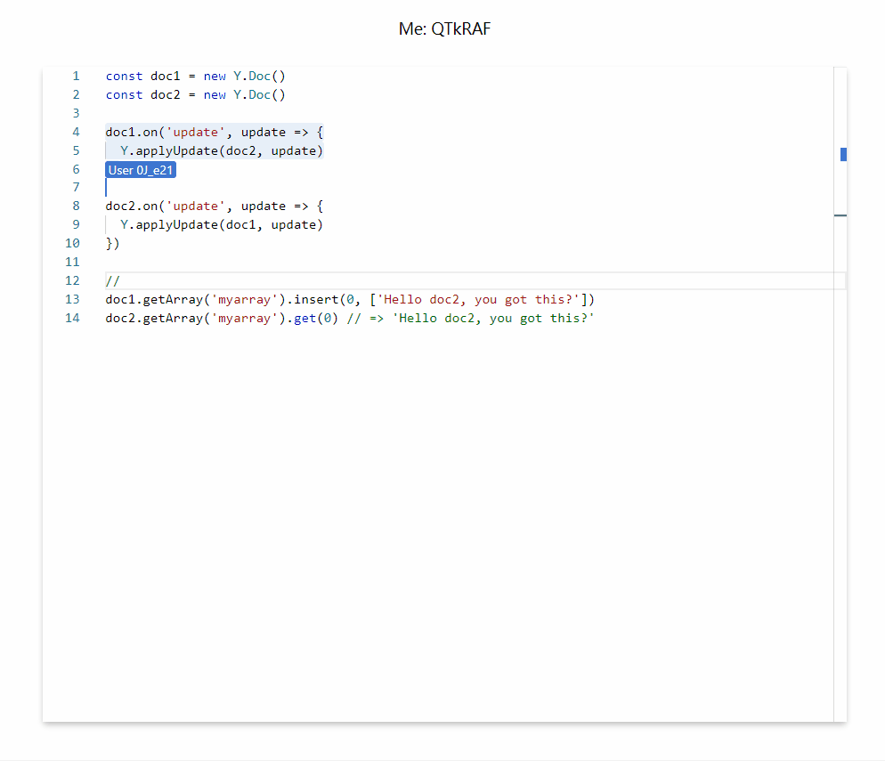

# monaco colab



Simple example for [yjs](https://github.com/yjs/yjs) collaborative editing on monaco editor powered by SignalR without y-protocols.

Some codes are modified from [yjs/y-monaco](https://github.com/yjs/y-monaco)([License](https://github.com/yjs/y-monaco/blob/master/LICENSE)) and [convergencelabs/monaco-collab-ext](https://github.com/convergencelabs/monaco-collab-ext)([License](https://github.com/convergencelabs/monaco-collab-ext/blob/master/LICENSE)).

## Get started

```shell
$ npm i
$ npx webpack # --watch --mode production
```

```shell
$ dotnet restore
$ dotnet run # --dev --urls http://localhost:8000
```
